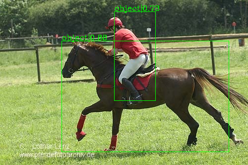
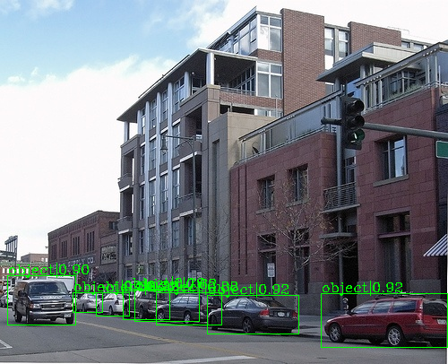
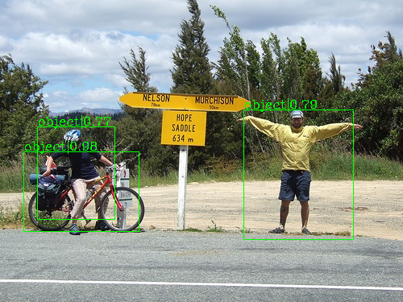
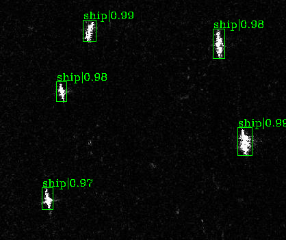
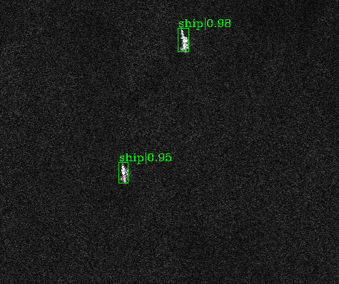
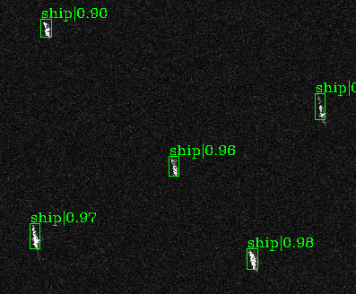
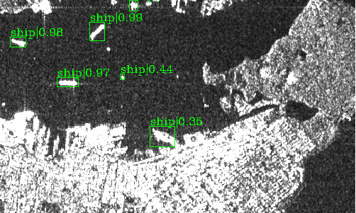

# Lightweight Object Detection(One-Stage)

## Introduction

The code is based on the mmdetection.

mmdetection is an open source object detection toolbox based on PyTorch. It is
a part of the open-mmlab project developed by [Multimedia Laboratory, CUHK](http://mmlab.ie.cuhk.edu.hk/).

Currently, it contains these features:
- **Multiple Base Network**: Mobilenet V2, ShuffleNet V2
- **One-Stage Lightweight Detector**: SSD, RetinaNet

## Performance

| VOC2007      | SSD                                                                         | RetinaNet                                                                   
|--------------|-----------------------------------------------------------------------------|-----------------------------------------------------------------------------|
| MobilenetV2  |                                                                             | 81.9                                                                        |
| ShufflenetV2 |                                                                             |                                                                             |

| COCO2017    | SSD                                                                         | RetinaNet                                                                   
|-------------|-----------------------------------------------------------------------------|-----------------------------------------------------------------------------|
| MobilenetV2 |                                                                             |                                                                             |

## TODO
